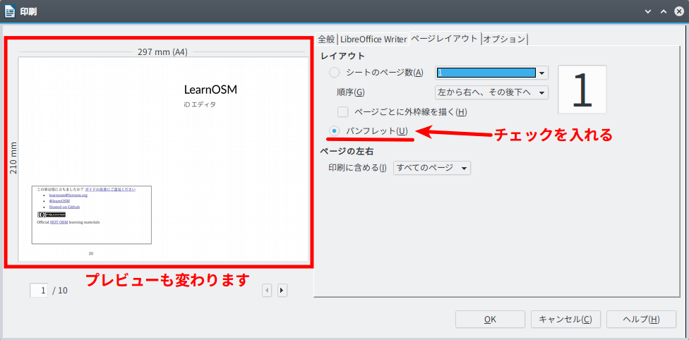

% PandocとLibreOffice WriterでiDエディタのマニュアルを製本する
% のがたじゅん <nogajun@gmail.com>
% 2014/12/6

PandocとLibreOffice WriterでiDエディタのマニュアルを製本する
==========================================================

この記事は [LibreOffice Advent Calendar 2014](http://www.adventar.org/calendars/507) 6日目の記事です。

Web上から[OpenStreetMap](http://www.openstreetmap.org/)が編集できる、iDというエディタがあります。
このエディタの解説が[LernOSM](http://learnosm.org/jp/)にPublic Domainで公開されているのですが、OSMマッピングパーティで人が集まった時には手元で見られるように紙に印刷したいと思い、[Pandoc](http://johnmacfarlane.net/pandoc/)とLibreOffice Writerを使って冊子を作成しました。

## Pandocとは

[Pandoc](http://johnmacfarlane.net/pandoc/)は、Haskellで書かれたドキュメント変換ツールです。
対応文書フォーマットの多さと変換クォリティの高さに定評があります。
Pandocの出力フォーマットにodtがあるので、今回はPandocを使ってHTMLからodtに変換し、LibreOffice Writerを使ってレイアウト編集、それを印刷して製本という手順で冊子を作成します。

Debianを使っている人は、aptでインストールできるのでインストールしておきましょう。

    $ sudo apt install pandoc

それ以外のプラットフォームの方は「[Installing](http://johnmacfarlane.net/pandoc/installing.html)」を参照して下さい。
Pandocの詳しい解説についてはユーザーズガイドの日本語訳もあるので、こちらも参照して下さい。

- Pandoc ユーザーズガイド 日本語版 - Japanese Pandoc User's Association: <http://sky-y.github.io/site-pandoc-jp/users-guide/>

## まずはPandocを使ってodtに変換してみる

冊子の元原稿となる、iDエディタマニュアルのWebページは以下になります。

- iDエディタ - LearnOSM: <http://learnosm.org/jp/editing/id-editor/>

iDエディタのマニュアルは単一ページです。PandocはhttpでアクセスしてHTML文書を取得できるので、以下のコマンドだけで変換ができます。

    $ pandoc -f html -t odt -o ideditor.odt http://learnosm.org/jp/editing/id-editor/

では、変換したodtファイルをWriterで開いてみましょう。

パッと見は悪くないように見えますが、フォントの設定などに違和感を感じると思います。
これはPandocがodtに変換する際に参照している「reference.odt」(テンプレートのottではありません)が、日本語の文書に適していない設定になっているためです。

この問題は、日本語の文書向けに設定したodtファイルをオプション「--reference-odt=FILENAME」で指定すると解決できるので参照用odtファイルを作成します。

## Pandoc参照用のodtファイルを作成する

Pandoc参照用odtファイルは、スタイルを設定しただけの空のodtファイルですが、独自に作成したodtファイルを使うとうまく変換できない場合もあります。
ですので、オリジナルのreference.odtをひな型にして作成します。

reference.odtについては、Debianでは/usr/share/pandoc/data/reference.odtにあるので、これをコピーするか、マニュアルにあるようにように出力して保存したものを用意します。

    $ pandoc --print-default-data-file reference.odt > reference.odt

それでは、用意したreference.odtをWriterで開いてスタイルを編集しますが、スタイルの編集の前に言語設定が日本語環境向けではないので修正しておきましょう。
メニューバー[ツール]-[オプション]からオプションダイアログを開き、以下の個所を変更します。

- [言語設定]-[言語]のアジア諸言語が「なし」になっているので、「標準 - 日本語」に変更
- [LibreOffice Wrter]-[規定のフォント(西欧諸言語)]が変更されているので、「標準」ボタンを押して戻す
- [LibreOffice Wrter]-[規定のフォント(アジア諸言語)]が変更されているので、「標準」ボタンを押して戻す

これで日本語の文書でも大丈夫です。
このほか日本語関係の設定で注意する点としては、標準ページスタイルの用紙サイズが「レター」になっていることと余白の幅が変更されています。

日本語の標準設定では、用紙サイズ「A4」、余白「2.0cm」ですが、出力する文書によってサイズ、余白は変わってくるので、メニューバー[書式]-[ページ]から確認して、自分が使用する用紙サイズと余白に設定しておきます。

### スタイルを作成する

ここからはスタイルの作成ですが、スタイルについては、手を入れる個所が多く、文章での説明は長くなるので、用意したサンプルファイル(reference-japanese.odt)を元にポイントを説明します。

#### 参照用odtファイルには、スタイルのテストを書いておく

参照用odtファイルは、中身に何が書いてあってもPandocからは無視されます。
スタイルを作成するとき見栄えを確認しながら調整すると作成しやすいので、あらかじめ使用するスタイルを適用した文章を書いておくとよいでしょう。

#### オプションの「規定のフォント」は揃えておく

「規定のフォント」はスタイルでフォントが指定されていない場合に利用されます。
最初に「規定のフォント」を戻しましたが、標準では欧文(西欧諸言語)と和文(アジア諸言語)それぞれ違うフォント、違うサイズで設定されるので、見栄えを整えるときに思わぬところで悩む原因になります。

和文と欧文をそれぞれ違うフォント・サイズを割り当てる設定は、スタイルを利用してもできるので、別々に設定したい場合は、スタイル側で設定をするようにして、オプションの「規定のフォント」は和文フォントに揃えておくとよいでしょう。
(reference-japanese.odtでは、見出し以外はIPAex明朝に揃えてあります。)

#### 段落スタイルの調整ポイント

- 「標準」は最初に設定する
- 「本文」を設定したら、Pandoc独自スタイルの「First Paragraph」も忘れずに設定する
- 「見出し」は作りこみましょう。
    - 「見出し1」は体裁の区切りを「挿入」にチェックを入れる

段落スタイルの「標準」はすべての段落スタイルの大元になるので、LibreOfficeのスタイル作成の基本としては、なにはなくとも最初に設定をします。
とはいえ、「標準」のスタイルを作り込み過ぎると継承するスタイルにも影響が出るので、設定は基本的な設定だけにとどめておきましょう。

「標準」の次に設定するのは「本文」になりますが、Pandocでは「本文」のほかに独自スタイルの「First Paragraph」も設定されているので忘れずに設定します。

「見出し」については、日本語ではなじまない斜体を使った見出しがあるので、斜体を使わない形に作りなおしておくと見栄えが良くなります。

大見出しである「見出し1」は、体裁タブにある区切り「挿入」にチェックを入れて、種類を「ページ」にしておくと、「見出し1」があればページの先頭から始まるようになるので設定しておくとよいでしょう。

これら以外のスタイルについては、最初からすべてを作りこむのは大変なので、足りない部分を継ぎ足していく形で作成すると楽に作業を進められます。

変換したファイルが使用しているスタイルを調べるには、「スタイルと書式」の表示を「使用したスタイル」にすると、使用しているスタイル一覧が表示されるので、これを元にするとよいでしょう。

### 参照用odtファイルを適用して変換する

作成した参照用ファイルを適用してHTML文書をodtに変換します。

変換の前に、毎回、ネットワークからダウンロードするのは時間もかかるので、ローカルに保存をしてからpandocで変換します。

HTMLの保存は、Firefox/Iceweaselの「ページを保存」を使うと手軽に画像を含めた完全な形で保存できるのでお薦めです。それ以外でも画像なども含めて保存できるなら、どの方法を使っても構いません。

では、odtに変換してみましょう。最初と違うのは「--reference-odt=reference-japanese.odt」で作成した参照用odtを指定している部分が違います。

    $ pandoc -f html -t odt --reference-odt=reference-japanese.odt -o ideditor.odt LearnOSM.html

変換したodtファイルを開いてみます。

    $ xdg-open ideditor.odt

なかなか、いい感じに変換できました。
これをそのまま印刷してもよいのですが、HTML文書で使われていたメニュー部分は不要ですし、レイアウトも紙の文書としてはおかしいので、これを調整して冊子に仕上げます。

## Writerを使って冊子として編集する

LibreOfficeの印刷には、用紙を真ん中で折ると冊子になるように印刷する「[パンフレットの印刷](https://help.libreoffice.org/Writer/Printing_a_Brochure/ja)」という機能があります。
この機能を使うと簡単に冊子用の印刷・PDFの出力ができるので、A5サイズの冊子として編集していきます。

### ページサイズをA4からA5に変更

「パンフレットの印刷」をするには、ページを印刷する用紙(A4)の半分のサイズ(A5)のページを2ページ面付けする必要があるので用紙サイズをA5に変更します。

変更は、サイドバーのプロパティから、標準ページスタイルの用紙サイズを「A5」余白を「狭い」(1.27cm)に変更しました。そして、表紙もつけたいのでページスタイルの「最初のページ」も同じ設定にしました。
これでA4に2ページ分、面付けできるようになりました。

### Pandocで変換した画像に注意

あとは用紙に収まるように編集していきますが、画像については注意が必要です。

Pandocは画像のアンカーをすべて「文字として」に設定して変換するので、画像をドラッグしても行内しか移動しませんし、画像の大きさを変更するとつられて文字組みもおかしくなります。
ですので、画像を移動したりレイアウトを変更する場合は、アンカーを「段落に」に変更する必要があります。

### タブを挿入して一気に表組みを作る

iDエディタの説明で、アイコンの機能説明が箇条書きで書いてありますが、これはちょっと不自然なので表組みに変更しました。

表を作成するとき、文字列がタブで区切られていると表の区切りとして認識されるので、箇条書きを解除して説明文とアイコンの間にタブを挿入。表組みにする個所を選択して[表]ボタンを押すと一気に表組みが作成できます。

### 画像の枠はスタイルで

HTML文書の画像には灰色の枠がついていましたが、LibreOfficeでは枠スタイルの「画像」に「外枠」をつけることで似たような感じにしました。

### 表紙をつける

冊子なので表紙をつけたいと思います。

表紙をつけるには、「タイトルページ」機能(メニューバー[書式]-[タイトルページ])を使うと、表紙ページとページ番号を自動で設定してくれるので便利です。

今回はページ番号を内容ページからつけたかったので利用しましたが、時間があれば表紙に凝ってみるのもいいかもしれません。

### 「パンフレットの印刷」で出力

編集が終わったら「パンフレットの印刷」で出力します。

「パンフレットの印刷」で出力するには、メニューバー[ファイル]-[印刷]で印刷ダイアログを開き、
「ページレイアウト」タブにあるラジオボタン「パンフレット」をクリックします。

印刷する場合は、このままプリンターを選んで **両面印刷** をするとパンフレットとして印刷できます。

PDFに出力するには、「オプション」タブにある「ファイルへ出力」にチェックを入れると「印刷」ボタンが「ファイルへ出力」ボタンに変わるので、PDFとして保存できます。

PDFに出力するとコンビニなどで印刷もできるので、とても便利です。

## 完成

こんな感じにできあがりました。
(印刷中)

## おまけ

作成したreference-japanese.odtですが、常用する場合は毎回オプションをつけるのは面倒なので、ファイル名を「reference.odt」に変更して以下のディレクトリに保存しておくと、odtに変換時に自動的に適用してくれます。

- Linux: $HOME/.pandoc
- Windows: C:\Users\USERNAME\AppData\Roaming\pandoc

また、変換に使うテンプレートも変更できるので、以下のように出力したodtテンプレートを

    $ pandoc -D odt ~/.pandoc/templates/default.opendocument

odtファイルに含まれるcontent.xmlを参考に変更すると、よりよい形に出力できると思います。

## 最後に

例では、HTMLで書かれた文書をodtに変換して編集しましたが、Pandocはさまざまな文書フォーマットに対応しているので、長文の原稿をMarkdownで書いて、LibreOfficeで編集して印刷といったこともできます。

ということで、PandocとLibreOffice Writerを使うと、テキストエディタで書いて、*そこそこ*見られる形に整形した文書が作成できるので活用してください。

