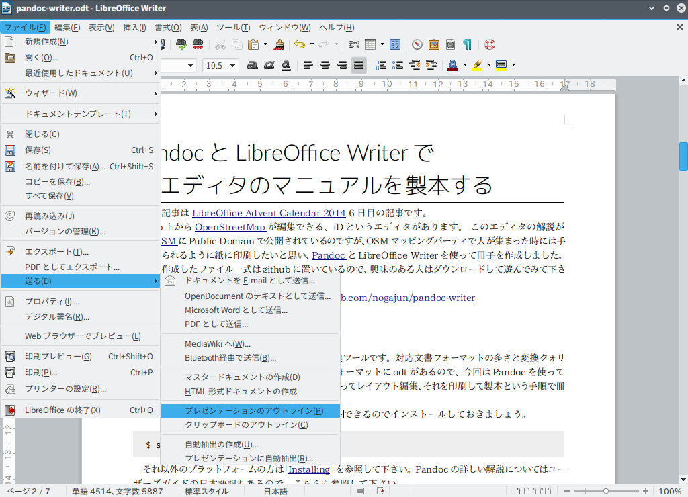
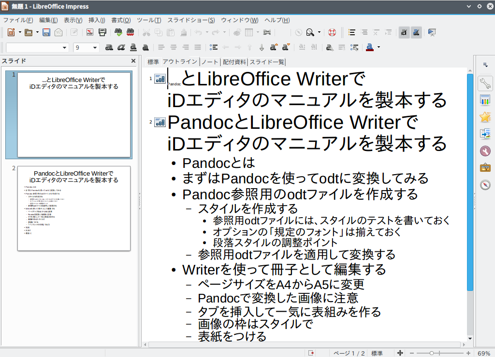
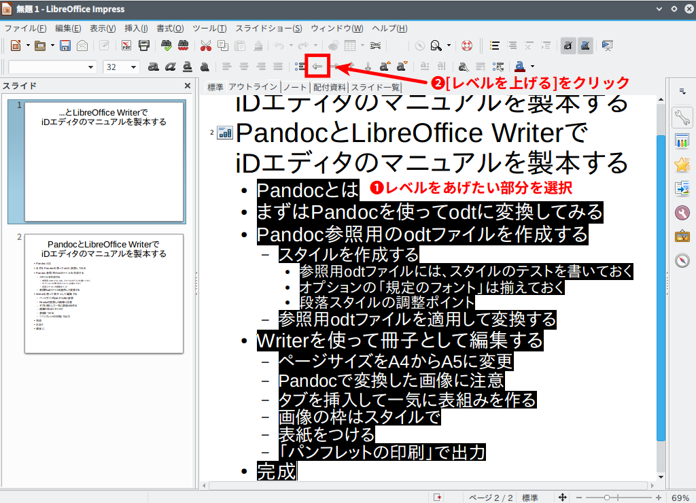
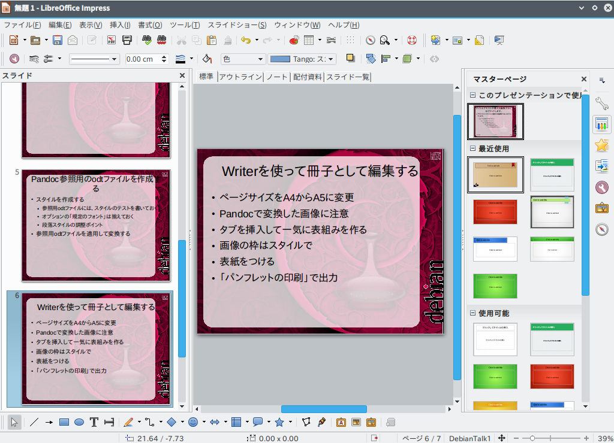
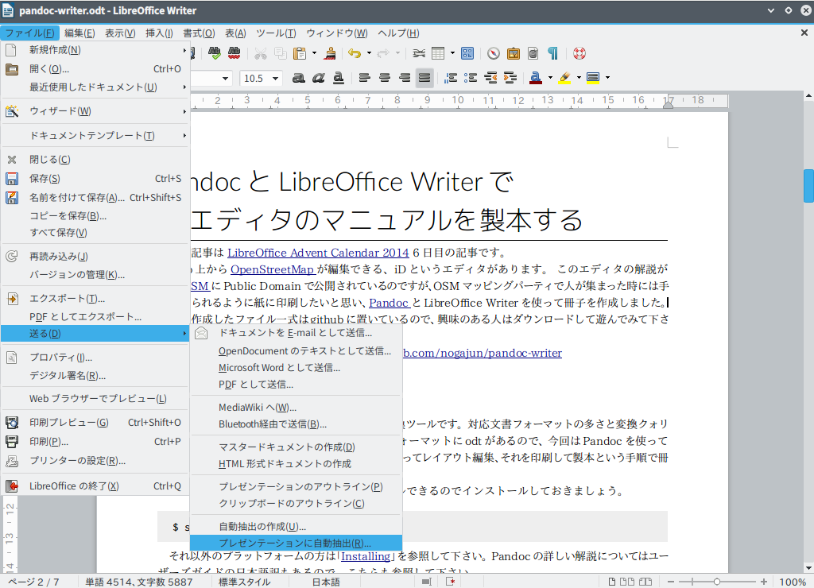
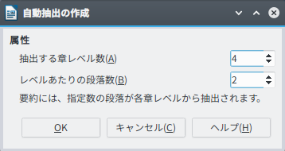
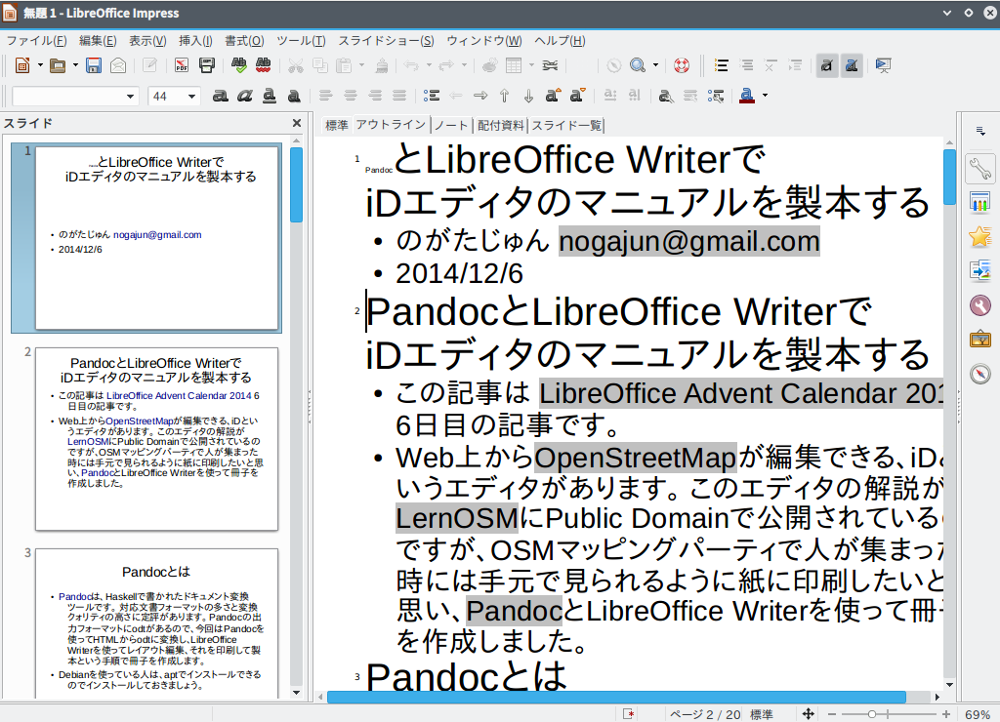
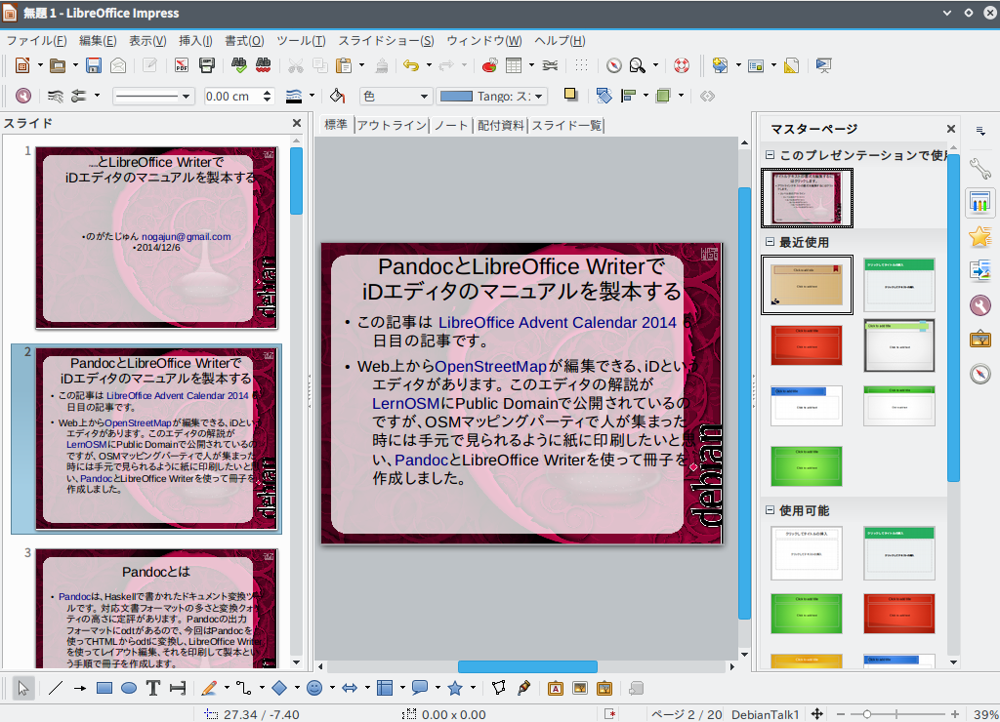

% Writer文書からImpressスライドのひな型を作成する
% のがたじゅん <nogajun@gmail.com>
% 2014/12/10

Writer文書からImpressスライドのひな型を作成する
=============================================

この記事は [LibreOffice Advent Calendar 2014](http://www.adventar.org/calendars/507) 10日目の記事です。

「[PandocとLibreOffice WriterでiDエディタのマニュアルを製本する](http://www.nofuture.tv/diary/20141206.html)」という記事を書きましたが、この記事はMarkdownを使って原稿を書き、Pandocを使ってodtに変換し、それを若干手直ししてPDFに出力しました。

原稿が作成できたなら次は発表ですよね。(どこで?)

発表となるとImpressでスライド作成ですが、原稿を書いてスライド作成となると二度手間で結構大変な作業です。できるなら、なるべく楽をしたいということで、Writerの原稿からImpressスライドのひな型を作成する2つの方法を紹介します。

## 原稿をスライドに変換できる条件

odtファイルをスライドに変換しますが、変換をするには条件があります。

その条件は、**「スタイルの見出しレベルがきちんと設定されていること」**です。

ですので、スタイルを利用していない原稿からはスライドのひな型は作成できません。
逆にMarkdownなどで書いて変換した文書は、文書構造もしっかりしていてスタイルも正しく設定されているので、すんなりと作成できます。

## 「プレゼンテーションのアウトライン」を使ってスライドを作成

最初に紹介するのは、見出しのアウトラインを使った「プレゼンテーションのアウトライン」です。
この方法は、スライド内容は自分で書くので、見出しのアウトラインだけを利用したい場合におすすめです。

まず、Writerでodtファイルを開いて、メニュー[ファイル]-[送る]-[プレゼンテーションのアウトライン]を選択します。

Impressが開いて、見出しからアウトラインが作成されます。

簡単ですね。
一部、フォントの属性が変わっている部分もあるので、テキストを全選択して、メニュー[書式]-[デフォルトの書式]で戻すとよいでしょう。

それ以外で気になる点は、「pandocとは」以下のアウトラインがスライド一枚に収まっています。
変換すると「見出し1」がスライドタイトルになり「見出し2」以下が内容になりますが、スライドとしてはおかしいので、「見出し2」をスライドタイトルにしてそれ以下を内容にする形で分割をします。

分割方法は、アウトラインレベルが上がればスライドは自動的に分割されるので、アウトラインの上げたい部分を選択して、[レベルを上げる]ボタンをクリックするだけです。

あとは内容や図を書き足して、マスターページを設定すればスライドの完成です。

## 「プレゼンテーションに自動抽出」を使ってスライドを作成

もうひとつの方法は「プレゼンテーションに自動抽出」を使う方法です。

「プレゼンテーションのアウトライン」は見出しアウトラインだけですが、「プレゼンテーションに自動抽出」は見出しのほか要約として最初の段落が入るので、文書の作成具合によっては、ほぼそのまま使えそうな感じにまで作成してくれます。

「プレゼンテーションに自動抽出」の適用方法はWriterでodtファイルを開いて、メニュー[ファイル]-[送る]-[プレゼンテーションに自動抽出]を選択します。

「自動抽出の作成」ダイアログが開くので「抽出する章レベル数」と「レベルあたりの段落数」を設定します。
今回は「抽出する章レベル数」を4。「レベルあたりの段落数」を2に指定して作成してみました。

Impressが開いて、見出しと要約が反映されたアウトラインが作成されます。

こちらも簡単ですね。

「プレゼンテーションのアウトライン」と違い内容も入っているので、マスターページを適用しただけで発表できそうな雰囲気です。
ということで、マスターページを適用してみました。

よく見るとおかしな部分もあるので、手直しして必要な内容や図を書き足す必要はありますが、かなり楽に作成できるのではないでしょうか。

## まとめ

スライドのひな型が簡単に作成できました。

この機能は[以前の日記に書いたネタ](http://www.nofuture.tv/diary/20140404.html#p01)でしたが、実際に試したことがなかったので、試したのが今回のお話しでした。

今回試して感じたことは、アウトラインがしっかりしている文書なら、ほぼそのままの形でスライド化できる事がわかったので、皆様もぜひ試してみてください。

